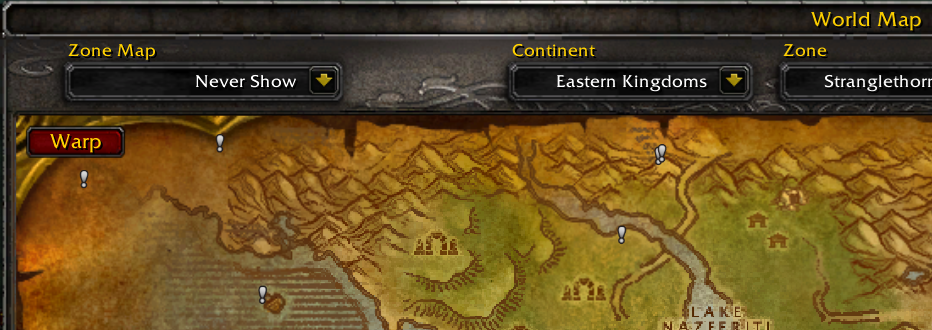

ScootsWarpMap 1.0.0.

## Description ##

This adds an alternative UI for warping.

Features:
- World-map view of warps overlaid on their zone.
- Adds a warp button to the world map when viewing a zone for which you have learned the warp.

## Usage ##

Type (or macro) `/scootswarpmap`.

## Installation ##

Download this repository, then extract the `ScootsWarpMap` subdirectory from the `src` directory into your `World of Warcraft/Interface/AddOns` directory.

## Screenshots ##

